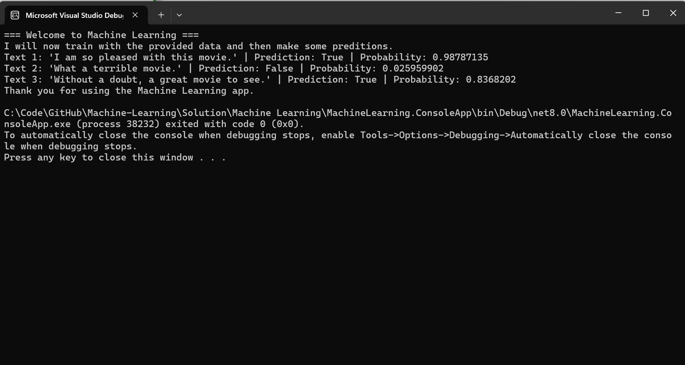

# Machine-Learning
A simple machine learning application written in C#.

## Features
- Performs binary classification (sentiment analysis).
- Performs automatic data loading.
- Defines a machine learning pipeline.
- Trains the machine learning model with data.
- Performs a prediction and includes the probability of it being correct.

## Screenshots 


## Examples
```
cmd> MachineLearning.ConsoleApp.exe
```

## To Run
After downloading the source code, then double click on the LinkChecker.ConsoleApp executable file in the bin directory.

## Source Code
View the project [Source Code]().

## How It Works
- Established a machine learning pipeline.
- Loads in custom provided training data.
- Performs a predicition of the test scenarios based on the training data.
- True means a positive sentiment, false means a negative one.
- Returns the predicition along with the popability of it being correct.

## Limitations
- Does not provide a GUI to work easier with the app.
- Does not recieve input text from the user to test.
- Does not recieve training data input from the user to learn.