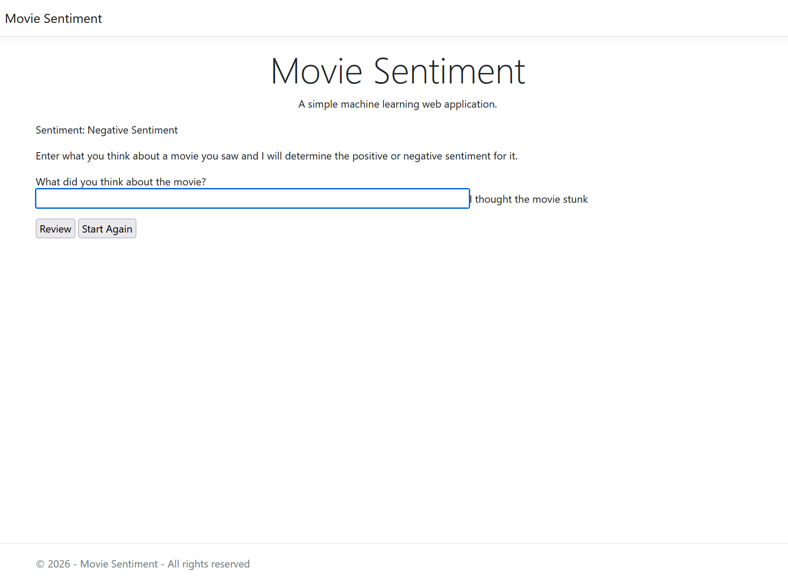

# Machine Learning
A simple machine learning application written in C#.

## Features
- Performs binary classification (positive or negative sentiment analysis).
- Performs automatic data loading.
- Trains the machine learning model with data.
- Performs a prediction on the users thoughts on a movie.

## Source Code
View the project [Source Code](https://github.com/hayes0278/Machine-Learning).

## How It Works
- Established a machine learning pipeline.
- Loads in custom provided training data.
- Performs a predicition of the test scenarios based on the training data.
- True means a positive sentiment, false means a negative one.
- Returns the predicition along with the popability of it being correct.

## Limitations
- Does not recieve training data input from the user to learn.

## Screenshots 

